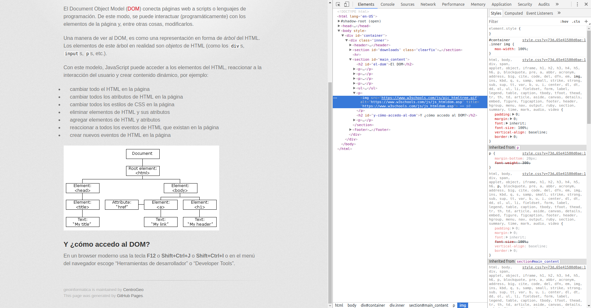

# La anatomía de una página web

Aquí vamos a hablar un poco de cómo está estructurada una página web. La idea no es que aprendan a hacer páginas sino que entiendan cuáles son los principales elementos que la conforman y cómo interactúan entre ellos.

## HTML

El [HTML](https://www.w3schools.com/html/) es el bloque de construcción más básico de una página, con el definimos la estructura general y organizamos el contenido. No es un lenguaje de programación sino un lenguaje de _marcado_, es decir, usa etiquetas para definir elementos como encabezados, párrafos, imágenes, etcétera. El _browser_ se encarga de convertir el HTML en la página que vemos.

Aquí tenemos un ejemplo súper simple de un HTML, cópialo y pégalo en un archivo y ábrelo con un navegador.

```html
<!DOCTYPE html>
<html>
    <head>
        <title>El título</title>
    </head>
    <body>

        <h1>Un encabezado</h1>
        <p>Y algo interesante que decir.</p>

    </body>
</html>
```
Como puedes ver, el _estilo_ de la página es muy _austero_, esto es porque en el modelo de desarrollo web el estilo, la organización y el contenido están separados: la organización es el HTML, el contenido es lo que está adentro de las etiquetas y el estilo, el estilo se cuece aparte...

## CSS

[CSS](https://www.w3schools.com/css/) quiere decir **C**ascading **S**tyle **S**heets y es el lenguaje con el que se define el estilo de una página. Permite definir los atributos de los elementos de HTML que definen la forma en la que el _browser_ los va a _dibujar_. Como ejemplo, definamos un CSS para la página del ejemplo anterior:

```css
body {
    background-color: lightblue;
}

h1 {
    color: white;
    text-align: center;
}

p {
    font-family: verdana;
    font-size: 20px;
}
```

Los encabezados que aparecen a la izquierda de las llaves se llaman _selectores_ y permiten seleccionar elementos ya sea por tipo, clase, identificador o relación. Para ver como funciona, vamos a agregarlo a nuestra página de ejemplo. Edita el HTML para que se vea así:

```html
<!DOCTYPE html>
<html>
    <head>
        <title>El título</title>
        <link rel="stylesheet" href="estilo.css">
    </head>
    <body>

        <h1>Un encabezado</h1>
        <p>Y algo interesante que decir.</p>

    </body>
</html>
```
Copia pega el CSS de arriba en un archivo y guárdalo como estilo.css. Ahora vuelve a abrir el HTML con el navegador.


## El DOM

DOM significa **D**ocument **O**bject **M**odel.

El Document Object Model ([DOM](https://www.w3schools.com/js/js_htmldom.asp)) conecta páginas web a scripts o lenguajes de programación. De este modo, se puede interactuar (programáticamente) con los elementos de la página y, entre otras cosas, modificarlos.

Una manera de ver al DOM, es como una representación en forma de _árbol_ del HTML.
Los elementos de este árbol en realidad son _objetos_ de HTML (como los `div`s, `input`s, `p`s, etc.).

Con este modelo, JavaScript puede acceder a los elementos del HTML, reaccionar a la interacción del usuario y crear contenido dinámico, por ejemplo:
* cambiar todo el HTML en la página
* cambiar todos los atributos de HTML en la página
* cambiar todos los estilos de CSS en la página
* eliminar elementos de HTML y sus atributos
* agregar elementos de HTML y atributos
* reaccionar a todos los eventos de HTML que existan en la página
* crear nuevos eventos de HTML en la página


## Y ¿cómo accedo al DOM?

Dependiendo del navegador, usa la tecla **F12** o **Shift+Ctrl+J** o **Shift+Ctrl+I** o en el menú del navegador escoge "Herramientas de desarrollador" o "Developer tools".

<a href = "./img/dev_tools.png"></a>

Estas herramientas nos permiten identificar elementos del DOM e interactuar con ellos, por ejemplo cambiando sus propiedades o incluso moviéndolos de lugar. Inténtalo con esta página.

En resumen, el DOM es la representación que nos permite interactuar, a través de Javascript, con el contenido y el formato de una página web. A partir de su organización podemos seleccionar elementos para modificarlos o agregar elementos en lugares específicos. 

## Javascript

[Javascript](https://www.w3schools.com/js/) es el lenguaje de programación para los navegadores, es la forma de interactuar programáticamente con el DOM. Javascript dota a las páginas web de las capacidades necesarias para la interactividad a la que estamos acostumbrados, sin él, todas las páginas serían [estáticas](http://toastytech.com/evil/).

En general, el código de Javascript se incluye de la misma forma en la que incluimos el CSS, sin embargo, a través de las Herramientas de desarrollador, podemos también escribir código usando la _consola_.

Ahora vamos a hacer un pequeño ejercicio, usando la consola de Javascript, para modificar el DOM y algunas propiedades de sus elementos. Para esto, vamos a editar nuestro HTML base para incluir clases e identificadores en los elementos. Estos atributos nos permiten seleccionar grupos de elementos para actuar sobre ellos usando Javascript o CSS.

```html
<!DOCTYPE html>
<html>
    <head>
        <title>El título</title>
        <link rel="stylesheet" href="estilo.css">
    </head>
    <body>

        <h1 id="encabezado">Un encabezado</h1>
        <p class="par">Y algo interesante que decir.</p>
        <p class="par">O a lo mejor no tanto</p>
        <p id="sinClase">!Yo no tengo clase!</p>
    </body>
</html>
```
Fíjense que ahora tenemos atributos en algunas etiquetas, `id` representa un identificador único para un elemento y `class` es un identificador para un conjunto de elementos. Ahora vamos a interactuar con ellos usando Javascript:

```javascript

var e = document.getElementById("encabezado"); // seleccionamos el elemento con id "encabezado"
e.style.color = 'red' // Cambiamos el estilo!

var ps = document.getElementsByClassName("par"); // seleccionamos todos los elementos con la clase par

var i; 
for (i = 0; i < ps.length; i++) { //iteramos sobre los elementos para cambiar el estilo
    ps[i].style.backgroundColor = "white";
}
```
Fíjense cómo `document.getElementById` nos regresa un único elemento, mientras que `document.getElementsByClassName` regresa un _array_ de elementos, esto es porque los ids son únicos (ojo, nadie va a checar que sean únicos, si no tenemos cuidado, cosas horribles pueden pasar), mientras que la clase está hecha para agrupar elementos.

Ahora, para terminar con esta introducción, vamos a agregar un elemento al DOM:
```javascript

var nodo = document.createElement("UL")  //Creo un nodo del tipo "UL"
var j;
for (j = 0; j < 4; j++) { 
    var hijo = document.createElement("LI")
    var textnode = document.createTextNode("Elemento " + j);
    hijo.appendChild(textnode);
    nodo.appendChild(hijo);
}
document.getElementById("sinClase").appendChild(nodo);
```

Continuar a [Los SVGs](svg.md)
