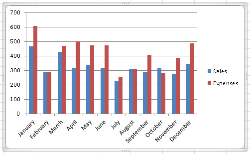

# Introducción a práctica a [`D3.js`](https://d3js.org/)

Todos hemos visto una gráfica de barras:



El objetivo de esta sección es hacer una gráfica de este tipo, pero en
el navegador, utilizando Javascript (JS pa los cuates) y D3.

D3.js es una librería de Javascript desarollada por [Mike Bostock](https://bost.ocks.org/mike/)
como parte de su tesis de doctorado en el MIT, mientras trabajaba en el New York Times.
D3 quiere decir **D**ata **D**riven **D**ocuments.
El fuerte de D3 es que la construcción e interacción con el DOM están basadas en los _datos_.

Primero, vamo a crear nuestro `.html` básico para la práctica:
```html
<!DOCTYPE html>
<html>
  <head>
    <title>Mi primer D3</title>
  </head>
  <body>
  </body>
</html>
```

Para "cargar" D3, hay que usar una etiqueta de `<script>` e incluir el archivo `.js` de D3 en nuestro archivo `.html`:
```javascript
<script src="https://d3js.org/d3.v4.min.js"></script>
```
Debe quedar así:
```html
<!DOCTYPE html>
<html>
  <head>
    <title>Mi primer D3</title>
  </head>
  <body>
  </body>
  <script src="https://d3js.org/d3.v4.min.js"></script>
</html>
```
Para estar seguros de que nuestra página web cargó correctamente la librería, podemos hacer una prueba rápida en la consola de las herramientas de desarrollador y escribir algo como:

```javascript
d3.select("body")
```
Si tu resultado es:
```
pt {_groups: Array(1), _parents: Array(1)}
```
¡Felicidades, puedes usar D3!
Si tienes algo como:
```javascript
Uncaught ReferenceError: d3 is not defined
    at <anonymous>:1:1
```
revisa cómo estás cargando la librería...

Una vez que estés seguro de que D3 funciona, sigue adelante. 

# Parte 1: una gráfica con elementos de HTML

Todo lo que vamos a hacer de aquí en adelante, salvo que se especifique lo contrario, es dentro de una etiqueta de `<script>` de HTML, como se muestra a continuación:
```html
<!DOCTYPE html>
<html>
  <head>
    <title>Mi primer D3</title>
  </head>
  <body>
  </body>
  <script src="https://d3js.org/d3.v4.min.js"></script>
  <script>
     /* Tu código va aquí */
  </script>
</html>
```
Ahora, supón que tenemos los siguientes datos para nuestra gráfica de barras. Lo más sencillo es tenerlos como un `Array` de JS, así que escribimos lo siguiente dentro de la etiqueta de `<script>`:
```javascript
var datos = [2, 7, 13, 19, 23, 47];
```

Si quisiéramos hacer la gráfica a mano, podríamos hacer algo como esto:
```html
<!DOCTYPE html>
<style>

.chart div {
  font: 10px sans-serif;
  background-color: steelblue;
  text-align: right;
  padding: 3px;
  margin: 1px;
  color: white;
}

</style>
<body>
  <div class="chart">
    <div style="width: 20px;">2</div>
    <div style="width: 70px;">7</div>
    <div style="width: 130px;">13</div>
    <div style="width: 190px;">19</div>
    <div style="width: 230px;">23</div>
    <div style="width: 470px;">47</div>
  </div>
  </body>
</html>
```
Es decir, creamos un `div`contenedor con clase `.chart` dentro del cual van a vivir las barras. Cada barra es otro `div` con un atributo que define el tamaño de la barra.

Pero en realidad, queremos crear las barras de manera autmática y usando D3. Es decir, queremos crear `div`s. Como ya vimos, con solo usar JS podemos modificar el DOM. D3 provee nuevas maneras de interactuar con el DOM. Por ejemplo, podemos crear nuevos elementos con la sintaxis propia de D3. D3 tiene una función que se llama `selectAll` que nos permite seleccionar **todos** los elementos de un tipo o clase. Se usa así:
```javascript
d3.selectAll("div");
```
Lo que regresa es un objeto de tipo [_selection_](https://github.com/d3/d3/blob/master/API.md#selections-d3-selection).
Lo poderoso es que si, por ejemplo, no hay `div`s en tu página, D3 los va a crear. Como queremos que las barras estén dentero del `div` contenedor que tiene clase `.chart`, también le decimos a D3 que seleccione esa clase, así:
```javascript
var chart = d3.select(".chart");
var barras = chart.selectAll("div");
 ```
Pero D3 tiene lo que se conoce como el _encadenamiento de métodos_ (_method chaining_, en inglés). Esto significa que podemos escribir lo anterior de una manera más compacta y concisa:
 ```javascript
var barras = d3.select(".chart")
  .selectAll("div");
 ```

Ahora, tenemos que decirle a D3 qué datos usar. Esto es muy sencillo al encadenar el método `data()`:
```javascript
var barras = d3.select(".chart")
  .selectAll("div")
  .data(datos);
 ```

**Recapitulación**: hasta aquí, tenemos un conjunto de  `div`s, que **NO** existen en el DOM, y los unimos con el conjunto de datos que queremos graficar. Ahora, lo que tenemos que hacer es iterar sobre esos `div`s que no existen y crearlos. Para eso, D3 tiene lo que se llama la seleccion `enter()`, que son todos los pedazos de la unión (entre datos y elementos) que aún no existen en el DOM.

Así se debe ver nuestro html:
```html
<!DOCTYPE html>
<html>
  <head>
    <title>Mi primer D3</title>
  </head>
  <style>
  
  .chart div {
    font: 10px sans-serif;
    background-color: steelblue;
    text-align: right;
    padding: 3px;
    margin: 1px;
    color: white;
  }
  
  </style>
  
  <body>
    <div class="chart"></div>
  </body>
  <script src="https://d3js.org/d3.v4.min.js"></script>
  <script>
    var datos = [2, 7, 13, 19, 23, 47];
  </script>
</html>
```
Prueba escribir en la consola lo siguiente:

```javascript
d3.select(".chart")
  .selectAll("div")
    .data(datos)
  .enter().append("div");
```
Puedes ver que salen 6 `div`s azules, todos del mismo tamaño. El responsable de agregarlos al DOM es `append()`. El siguiente paso es ajustarles el tamaño y ponerles una etiqueta:
```javascript
d3.select(".chart")
  .selectAll("div")
    .data(datos)
  .enter().append("div")
    .style("width", function(d) { return d * 10 + "px"; })
    .text(function(d) { return d; });
```
El código completo queda así:
```html
<!DOCTYPE html>
<html>
  <head>
    <title>Mi primer D3</title>
  </head>
  <style>
  
  .chart div {
    font: 10px sans-serif;
    background-color: steelblue;
    text-align: right;
    padding: 3px;
    margin: 1px;
    color: white;
  }
  
  </style>
  
  <body>
    <div class="chart"></div>
  </body>
  <script src="https://d3js.org/d3.v4.min.js"></script>
  <script>
    var datos = [2, 7, 13, 19, 23, 47];
    d3.select(".chart")
      .selectAll("div")
        .data(datos)
      .enter().append("div")
        .style("width", function(d) { return d * 10 + "px"; })
        .text(function(d) { return d; });
  </script>
</html>
```

Regresar a [2. Los SVGs](svg.md) | Continuar a [4. Conceptos básicos de D3](d3_2.md)
